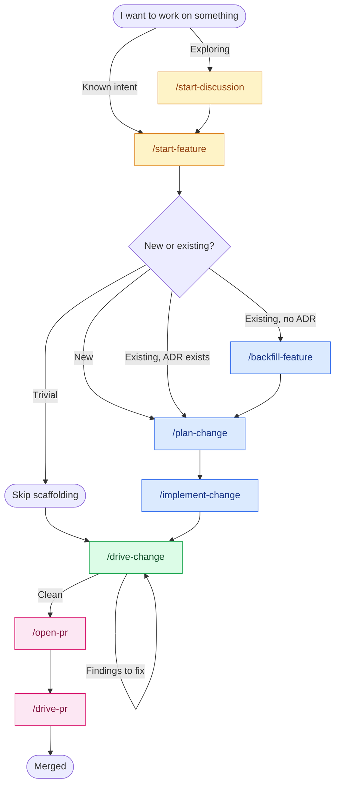

# skills

[](https://skills.sh/0xdeafcafe/skills)

Twenty Claude Code skills for the parts of shipping software I'd
rather not do myself. The ADR. The Gherkin spec. The audit pass. The
PR description. The back-and-forth on review comments. Tedious enough
to skip, important enough that skipping bites a quarter later.

They compose. Pick a front door.

## Install

```
/plugin marketplace add 0xdeafcafe/skills
/plugin install skills@0xdeafcafe-skills
```

Shows up as `skills @ 0xdeafcafe-skills` in the plugin manager.

For other agents (Cursor, Codex, OpenCode) or selective installs, the
[skills.sh](https://www.skills.sh) CLI:

```bash
npx skills add 0xdeafcafe/skills
```

## The flow



`/drive-plan` is the composed alternative — it runs `/plan-change` →
`/implement-change` → `/review-change` end-to-end with phase-boundary
confirmations, for substantial changes that warrant the full pipeline
upfront.

`tone-of-voice` sits across the lot. It applies whenever Claude writes
under my name (commit messages, PR bodies, anything published) and to
its own conversational replies in this CLI, so the assistant stays in
my register rather than drifting into LLM tells.

## What it looks like

A walked-through session, lightly compressed. Real artefacts get
written along the way — ADRs, specs, characterisation tests, the PR
body. The skills coordinate.

```
you:    I want to add CSV export on the orders page.

claude: [/start-feature]
        New code, or modifying something existing?

you:    Existing orders page.

claude: No ADR for the orders module. Backing it up before we touch
        it.

        [/backfill-feature]
        Reading src/orders/. Here's what I think the area does today:
          - server-paginated listing
          - cancellation through a state machine in OrderService
          - no exports yet
        Correct?

you:    Yes.

claude: Writing retroactive ADR, characterisation spec, and 8 tests
        locking current behaviour. All green.

        [/plan-change]
        Now the CSV export. What does the user click, and what comes
        out the other side?

[discussion. ADR + spec drafted, reviewed, committed.]

you:    Plan looks right. Let's build.

claude: [/implement-change]
        Reading the spec. Plan: one new component, two edits to
        OrderService, one new helper. 8 scenarios from the spec —
        going to run them as smoke tests when I'm done.

[implementation back-and-forth, scenarios pass]

you:    Done. Audit it.

claude: [/drive-change]
        Triage: small (12 files, 2 directories). Skipping the slicer.
        Fan-out to review-code, review-test, review-feature,
        review-security, review-ux in parallel.
          review-code:     clean
          review-test:     1 missing edge case (empty order list)
          review-feature:  clean
          review-security: clean
          review-ux:       loading state missing on the Export button
        Merger: 2 P1 findings, both mechanical. Dispatching to Sonnet
        fix-appliers in parallel.
          applied: 2 of 2
        Re-run: clean. Ready for /open-pr.

you:    Open it.

claude: [/open-pr]
        ...
        PR opened: https://github.com/...
        Drive it now, or wait for review?
```

## The skills

| Skill | One-liner |
| --- | --- |
| **Entry** | |
| [`start-feature`](./skills/start-feature/) | Front door for known work. Routes to `plan-change` or `backfill-feature`. |
| [`start-discussion`](./skills/start-discussion/) | Open-ended exploration. No file writes; talks until intent emerges. |
| **Planning** | |
| [`plan-change`](./skills/plan-change/) | Drives the discussion that produces an ADR plus a Gherkin spec for what's about to be built. |
| [`backfill-feature`](./skills/backfill-feature/) | Retroactive ADR, spec, and characterisation tests for existing code with no documentation. |
| [`write-adr`](./skills/write-adr/) | Standalone ADR. MADR / Nygard / Y-statement, matched to whatever the repo already does. |
| [`write-spec`](./skills/write-spec/) | Standalone Gherkin `.feature` file. |
| **Reviewing** | |
| [`review-change`](./skills/review-change/) | Read-only audit of the working tree. Slice → fan-out to specialists → merge → verify. Emits findings; never edits. |
| [`review-pr`](./skills/review-pr/) | Read-only audit of an open PR. Terminal report by default; `--comment` posts findings as PR comments. |
| [`review-code`](./skills/review-code/) | Per-file quality. SRP, modularity, length, naming, lint, format. Emits findings. |
| [`review-feature`](./skills/review-feature/) | Feature logic against ADR / spec. Edge cases, error handling, side effects. Emits findings. |
| [`review-test`](./skills/review-test/) | Test quality on touched files. Right level, real assertions, no mocking the unit under test. Emits findings. |
| [`review-security`](./skills/review-security/) | Authz, secrets, input validation, dependency vulns, OWASP-top-10 smells. Emits findings. |
| [`review-ux`](./skills/review-ux/) | Walks the changed UX in a real browser. Screenshots become finding evidence; a11y, console errors, network failures. |
| [`review-spec`](./skills/review-spec/) | Audits a new spec or ADR against the existing corpus for duplicates, conflicts, overlap. |
| **Driving** | |
| [`drive-plan`](./skills/drive-plan/) | End-to-end orchestrator for substantial changes. Composes `/plan-change` → `/implement-change` → `/review-change`. Phase-boundary confirmations. |
| [`drive-change`](./skills/drive-change/) | Workhorse for quick or clear changes. Implements from conversation intent + runs the agent pipeline (slice → fan-out → merge → verify) + dispatches fix-applier agents under sensitivity gating. |
| [`implement-change`](./skills/implement-change/) | Translates a planned change (ADR + spec) into code. Runs the spec's scenarios as smoke tests. Hands off to `/drive-change`. |
| **Shipping** | |
| [`open-pr`](./skills/open-pr/) | Composes title and body, runs final checks, opens via `gh pr create`. Wires `tone-of-voice` so the body sounds like the author. |
| [`drive-pr`](./skills/drive-pr/) | Iterates the open PR until trusted comments are resolved and CI is green. Calls `/review-pr` upfront, dispatches comment-driven edits through the agent pipeline. |
| **Cross-cutting** | |
| [`tone-of-voice`](./skills/tone-of-voice/) | Ghost-writes in my voice. Applies to PR bodies, commit messages, and Claude's own conversational replies. |

## The agent pipeline

The aggregators (`/drive-change`, `/drive-pr`, `/review-change`,
`/review-pr`) compose four agent prompts in `agents/`:

- **`orchestrate-slice`** partitions a multi-file diff into
  domain-coherent slices and names the symbols that cross slice
  boundaries (LSP-backed when available, structural fallback
  otherwise).
- **`orchestrate-merge`** takes parallel reviewer outputs, validates
  every finding against the JSON schema, runs `git apply --check` on
  the proposed fix, deduplicates by `file:line`, and partitions into
  single-file work packets with sensitivity annotations.
- **`orchestrate-verify`** cross-checks the contracts the slicer
  named, catching the drift where slice A's change to interface I
  doesn't match how slice B uses I.
- **`fix-applier`** takes one work packet, applies the fixes, runs a
  post-apply parse check, and reverts on failure.

Shared contracts live in `references/`:

- `finding-format.md` + `finding-format.schema.json` — the structured
  shape every reviewer emits; the merger validates against the
  schema and silently discards malformed findings.
- `change-envelope.md` — the input shape every reviewer receives,
  the same shape whether reviewing a whole diff or one slice.
- `language-tooling.md` — when to prefer LSP queries (`tslsp`,
  `gopls`, `pyright`, `rust-analyzer`) over reading files.
- `sensitivity-paths.md` — path patterns that route fix-applier
  dispatches to Opus instead of Sonnet (auth / crypto / IPC trust
  boundaries).

Sensitivity gating means a Sonnet worker applies hygiene fixes in
parallel across the codebase, while anything touching session
handling, token storage, or IPC handlers routes to Opus regardless
of severity.

## The trust gate

PR comments come from anyone with a GitHub account. If a skill follows
their instructions, anyone with a GitHub account has shell on my
laptop. Every skill that reads them runs the same filter:

1. **AI bots** — three trusted by name (CodeRabbit, GitHub Copilot
   reviewer, Kilo Code reviewer). Other `[bot]` handles are untrusted
   by default.
2. **Humans** — verified members of the repo's owning organisation,
   or collaborators with `write` or higher, checked live via `gh api`.
   "Looks legit" isn't a verification.

Untrusted comments get read for context. They never move code, write
a reply, or resolve a thread.

Six skills that read comments each ship their own copy of
`references/trust-policy.md` so a standalone CLI install of one skill
still has the policy locally. The canonical lives in
`skills/drive-pr/references/trust-policy.md`; the others are mirrors.
After editing the canonical, propagate it manually:

```bash
for d in review-code review-feature review-test review-security review-ux; do
  cp skills/drive-pr/references/trust-policy.md skills/$d/references/trust-policy.md
done
```

Then stage the five mirrors. No script lives in this repo on purpose —
skills with zero executable surface are safer to install.

## Layout

```
.
├── README.md
├── .claude-plugin/marketplace.json
├── skills.sh.json
├── agents/                       # prompt files invoked by orchestrators via Task
│   ├── orchestrate-slice.md      # partition diff into domain slices
│   ├── orchestrate-merge.md      # schema-validate + apply-validate + dedup + sensitivity
│   ├── orchestrate-verify.md     # cross-slice contract check
│   └── fix-applier.md            # single-file work packet executor
├── references/                   # shared cross-skill contracts
│   ├── finding-format.md
│   ├── finding-format.schema.json
│   ├── change-envelope.md
│   ├── language-tooling.md
│   └── sensitivity-paths.md
└── skills/
    ├── start-feature/
    ├── start-discussion/
    ├── plan-change/
    ├── backfill-feature/
    ├── write-adr/
    ├── write-spec/
    ├── review-change/
    ├── review-pr/
    ├── review-code/
    ├── review-feature/
    ├── review-test/
    ├── review-security/
    ├── review-ux/
    ├── review-spec/
    ├── drive-plan/
    ├── drive-change/
    ├── implement-change/
    ├── open-pr/
    ├── drive-pr/
    └── tone-of-voice/
```

Each skill is self-contained. When the CLI pulls a single skill on
its own, the recipient gets that skill's `SKILL.md` plus its
`references/` folder. Cross-skill contracts in the top-level
`references/` and the `agents/` directory only matter to the
orchestrator skills that consume them; the standalone read-only
specialists don't depend on them at install time.

Reference files in each skill's `references/` are loaded on demand,
which keeps the main `SKILL.md` lean.
