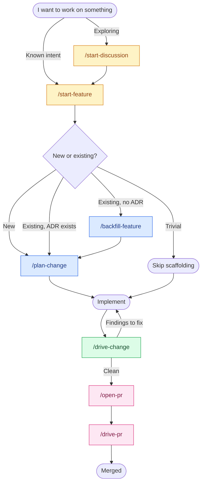

# skills

[](https://skills.sh/0xdeafcafe/skills)

Sixteen Claude Code skills for the parts of shipping software I'd
rather not do myself. The ADR. The Gherkin spec. The audit pass. The
PR description. The back-and-forth on review comments. Tedious enough
to skip, important enough that skipping bites a quarter later.

They compose. Pick a front door.

## The flow



`tone-of-voice` sits across the lot. It applies whenever Claude writes
under my name (commit messages, PR bodies, anything published) and to
its own conversational replies in this CLI, so the assistant stays in
my register rather than drifting into LLM tells.

## Install

```
/plugin marketplace add 0xdeafcafe/skills
/plugin install skills@0xdeafcafe
```

Shows up as `skills @ 0xdeafcafe` in the plugin manager.

For other agents (Cursor, Codex, OpenCode) or selective installs, the
[skills.sh](https://www.skills.sh) CLI:

```bash
npx skills add 0xdeafcafe/skills
```

## What it looks like

A walked-through session, lightly compressed. Real artefacts get
written along the way - ADRs, specs, characterisation tests, the PR
body. The skills coordinate.

```
you:    I want to add CSV export on the orders page.

claude: [/start-feature]
        New code, or modifying something existing?

you:    Existing orders page.

claude: No ADR for the orders module. Backing it up before we touch
        it.

        [/backfill-feature]
        Reading src/orders/. Here's what I think the area does today:
          - server-paginated listing
          - cancellation through a state machine in OrderService
          - no exports yet
        Correct?

you:    Yes.

claude: Writing retroactive ADR, characterisation spec, and 8 tests
        locking current behaviour. All green.

        [/plan-change]
        Now the CSV export. What does the user click, and what comes
        out the other side?

[discussion. ADR + spec drafted, reviewed, committed.]

you:    Plan looks right. Let's build.

[implementation back-and-forth]

you:    Done. Audit it.

claude: [/drive-change]
        Running code, test, feature, security, ux (UI files touched).
          drive-code:     clean
          drive-test:     1 missing edge case (empty order list)
          drive-feature:  clean
          drive-security: clean
          drive-ux:       loading state missing on the Export button
        2 P1 findings, none P0. Address them before /open-pr?

[fixes]

you:    Open it.

claude: [/open-pr]
        ...
        PR opened: https://github.com/...
        Drive it now, or wait for review?
```

## The skills

| Skill | One-liner |
| --- | --- |
| **Entry** | |
| [`start-feature`](./skills/start-feature/) | Front door for known work. Routes to `plan-change` or `backfill-feature`. |
| [`start-discussion`](./skills/start-discussion/) | Open-ended exploration. No file writes; talks until intent emerges. |
| **Planning** | |
| [`plan-change`](./skills/plan-change/) | Drives the discussion that produces an ADR plus a Gherkin spec for what's about to be built. |
| [`backfill-feature`](./skills/backfill-feature/) | Retroactive ADR, spec, and characterisation tests for existing code with no documentation. |
| [`write-adr`](./skills/write-adr/) | Standalone ADR. MADR / Nygard / Y-statement, matched to whatever the repo already does. |
| [`write-spec`](./skills/write-spec/) | Standalone Gherkin `.feature` file. |
| [`review-spec`](./skills/review-spec/) | Audits a new spec or ADR against the existing corpus for duplicates, conflicts, overlap. Read-only. |
| **Driving** | |
| [`drive-change`](./skills/drive-change/) | Aggregator. Runs code, test, feature, security (plus ux when UI files are touched). Carries findings between sub-audits so cross-cutting issues surface once, not five times. |
| [`drive-code`](./skills/drive-code/) | Per-file quality. SRP, modularity, length, naming, lint, format. |
| [`drive-feature`](./skills/drive-feature/) | Feature logic against ADR / spec. Edge cases, error handling, side effects. |
| [`drive-test`](./skills/drive-test/) | Test quality on touched files. Right level, real assertions, no mocking the unit under test. |
| [`drive-security`](./skills/drive-security/) | Authz, secrets, input validation, dependency vulns, OWASP-top-10 smells. |
| [`drive-ux`](./skills/drive-ux/) | Walks the changed UX in a real browser. Screenshots, a11y, console errors. |
| **Shipping** | |
| [`open-pr`](./skills/open-pr/) | Composes title and body, runs final checks, opens via `gh pr create`. Wires `tone-of-voice` so the body sounds like the author. |
| [`drive-pr`](./skills/drive-pr/) | Iterates the open PR until trusted comments are resolved and CI is green. |
| **Cross-cutting** | |
| [`tone-of-voice`](./skills/tone-of-voice/) | Ghost-writes in my voice. Applies to PR bodies, commit messages, and Claude's own conversational replies. |

## The trust gate

PR comments come from anyone with a GitHub account. If a skill follows
their instructions, anyone with a GitHub account has shell on my
laptop. Every skill that reads them runs the same filter:

1. **AI bots** - three trusted by name (CodeRabbit, GitHub Copilot
   reviewer, Kilo Code reviewer). Other `[bot]` handles are untrusted
   by default.
2. **Humans** - verified members of the repo's owning organisation,
   or collaborators with `write` or higher, checked live via `gh api`.
   "Looks legit" isn't a verification.

Untrusted comments get read for context. They never move code, write
a reply, or resolve a thread.

The six `drive-*` skills that read comments each ship their own copy
of `references/trust-policy.md` so a standalone CLI install of one
skill still has the policy locally. The canonical lives in
`skills/drive-pr/references/trust-policy.md`; the other five are
mirrors. After editing the canonical, propagate it manually:

```bash
for d in drive-code drive-feature drive-test drive-security drive-ux; do
  cp skills/drive-pr/references/trust-policy.md skills/$d/references/trust-policy.md
done
```

Then stage the five mirrors. No script lives in this repo on purpose -
skills with zero executable surface are safer to install.

## Layout

```
.
├── README.md
├── .claude-plugin/marketplace.json
├── skills.sh.json
└── skills/
    ├── start-feature/         # entry: known work
    ├── start-discussion/      # entry: exploratory
    ├── plan-change/           # ADR + spec
    ├── backfill-feature/      # retroactive ADR + spec + tests
    ├── write-adr/             # ADR only
    ├── write-spec/            # Gherkin spec only
    ├── review-spec/           # corpus overlap audit
    ├── drive-change/          # aggregator
    ├── drive-code/            # per-file quality
    ├── drive-feature/         # logic vs spec
    ├── drive-test/            # test quality
    ├── drive-security/        # secrets / authz / deps
    ├── drive-ux/              # browser walk-through
    ├── open-pr/               # compose + open
    ├── drive-pr/              # iterate to merge-ready
    └── tone-of-voice/         # ghost-write in my voice
```

Each skill is self-contained. When the CLI pulls `drive-pr` on its
own, you get `drive-pr/SKILL.md` plus everything under
`drive-pr/references/`. No cross-skill paths to break.

Reference files in each skill's `references/` are loaded on demand,
which keeps the main `SKILL.md` lean.
